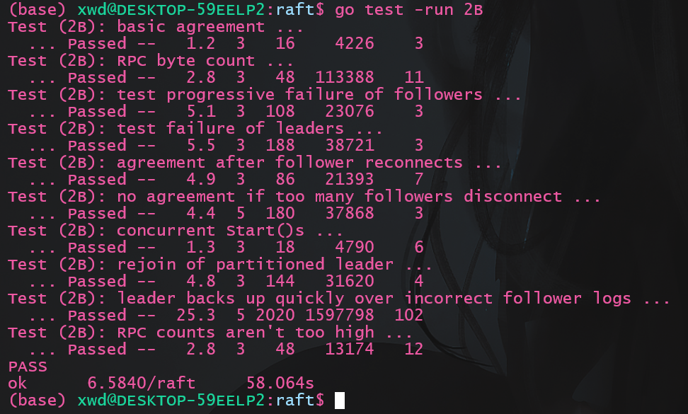
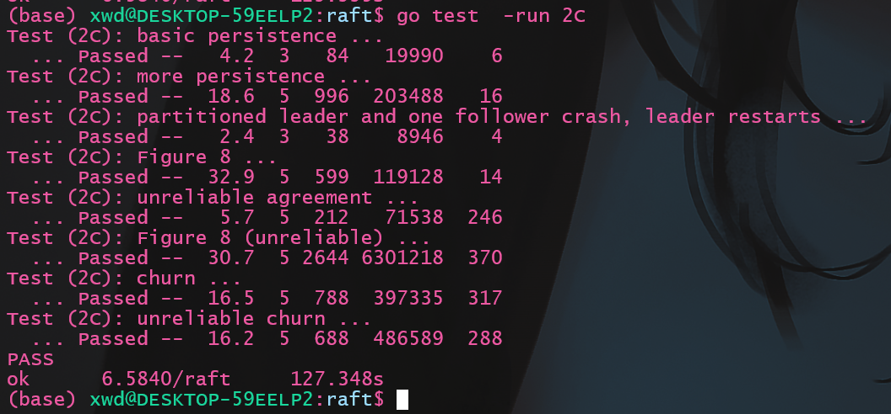
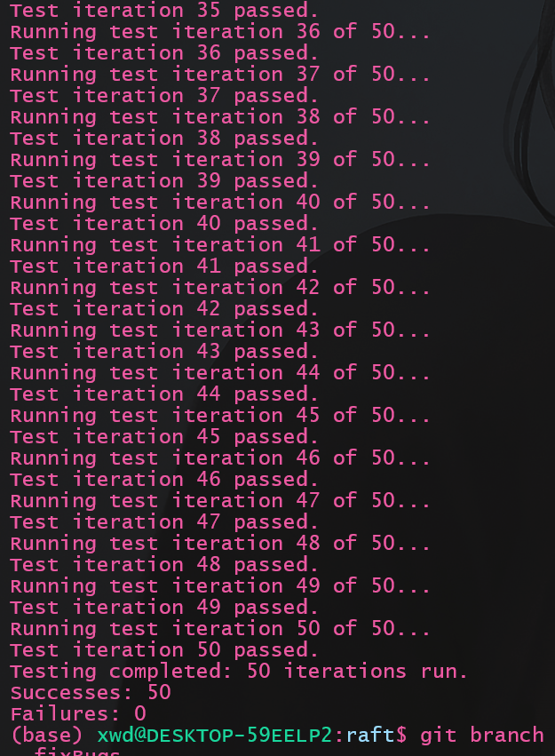

本文将介绍`lab2C`部分的实现, `lab2C`要求实现`raft`中的持久化功能, 相比`lab2A`,和`lab2B`, 本节的难度其实很小, 但复杂的是`lab2A`,和`lab2B`中的一些微小的`bug`会在`2C`中显现, 并且相对不太容易注意到。

`Lab文档`见: https://pdos.csail.mit.edu/6.824/labs/lab-raft.html

我的代码: https://github.com/ToniXWD/MIT6.5840/tree/lab2C

[raft原论文](https://pdos.csail.mit.edu/6.824/papers/raft-extended.pdf)

# 1 `bug`修复：重复的`RPC`
在之前的`AppendEntries`中有这样的代码:
```go
if len(args.Entries) != 0 && len(rf.log) > args.PrevLogIndex+1 && rf.log[args.PrevLogIndex+1].Term != args.Entries[0].Term {
    // 发生了冲突, 移除冲突位置开始后面所有的内容
    DPrintf("server %v 的log与args发生冲突, 进行移除\n", rf.me)
    rf.log = rf.log[:args.PrevLogIndex+1]
}
```
这段代码所做的事情是, 如果将要追加的位置存在日志项, 且日志项与`RPC`中的日子切片的第一个发生冲突(`Term`不匹配), 则将冲突位置及其之后的日志项清除掉。

这段代码看起来没有问题，但在高并发的场景下，会存在如下问题:
1. `Leader`先发送了`AppendEntries RPC`, 我们记为`RPC1`
2. `Follower`收到`RPC1`, 发生上述代码描述的冲突, 将冲突部分的内容清除, 并追加`RPC1`中的日志切片
3. 由于并发程度高, `Leader`在`RPC1`没有收到回复时又发送了下一个`AppendEntries RPC`, 由于`nextIndex`和`matchIndex`只有在收到回复后才会修改, 因此这个新的`AppendEntries RPC`, 我们记为`RPC2`, 与`RPC1`是一致的
4. `Follower`收到`RPC2`, 由于`RPC2`和`RPC1`完全相同, 因此其一定不会发生冲突, 结果是`Follower`将相同的一个日志项切片追加了2次!

**解决方案:**
很简单, 直接截断切片, 去掉`if`判断的条件:
```go
if len(args.Entries) != 0 && len(rf.log) > args.PrevLogIndex+1 {
    rf.log = rf.log[:args.PrevLogIndex+1]
}
```

# 2 优化: 快速回退
在之前的回退实现中, 如果有`Follower`的日志不匹配, 每次`RPC`中, `Leader`会将其`nextIndex`自减1来重试, 但其在某些情况下会导致效率很低, 因此需要`AppendEntries RPC`的回复信息携带更多的字段以加速回退, 核心思想就是:**`Follower`返回更多信息给`Leader`，使其可以以`Term`为单位来回退**

教授在课堂上已经介绍了快速回退的实现机制, 可以看我整理的[笔记](https://tonixwd.github.io/2024/01/12/MIT6.5840/Lec06%E7%AC%94%E8%AE%B0/) 

我的实现和课堂的介绍基本一致, 只是将`XLen`从`空白的Log槽位数`改为`Log的长度`:

## 2.1 结构体定义
```go
type AppendEntriesReply struct {
	// Your data here (2A).
	Term    int  // currentTerm, for leader to update itself
	Success bool // true if follower contained entry matching prevLogIndex and prevLogTerm
	XTerm   int  // Follower中与Leader冲突的Log对应的Term
	XIndex  int  // Follower中，对应Term为XTerm的第一条Log条目的索引
	XLen    int  // Follower的log的长度
}
```

## 2.2 `Follower`侧的`AppendEntries`
发现冲突时, 回复的逻辑为:
1. 如果`PrevLogIndex`位置不存在日志项, 通过设置`reply.XTerm = -1`告知`Leader`, 并将`reply.XLen`设置为自身日志长度
2. 如果`PrevLogIndex`位置日志项存在但`Term`冲突, 通过`reply.XTerm`和`reply.XIndex`分别告知冲突位置的`Term`和这个`Term`在`Follower`中第一次出现的位置

具体代码如下:

```go
func (rf *Raft) AppendEntries(args *AppendEntriesArgs, reply *AppendEntriesReply) {
    rf.mu.Lock()
	defer rf.mu.Unlock()
    ...
	isConflict := false

	// 校验PrevLogIndex和PrevLogTerm不合法
	// 2. Reply false if log doesn’t contain an entry at prevLogIndex whose term matches prevLogTerm (§5.3)
	if args.PrevLogIndex >= len(rf.log) {
		// PrevLogIndex位置不存在日志项
		reply.XTerm = -1
		reply.XLen = len(rf.log) // Log长度
		isConflict = true
		DPrintf("server %v 的log在PrevLogIndex: %v 位置不存在日志项, Log长度为%v\n", rf.me, args.PrevLogIndex, reply.XLen)
	} else if rf.log[args.PrevLogIndex].Term != args.PrevLogTerm {
		// PrevLogIndex位置的日志项存在, 但term不匹配
		reply.XTerm = rf.log[args.PrevLogIndex].Term
		i := args.PrevLogIndex
		for rf.log[i].Term == reply.XTerm {
			i -= 1
		}
		reply.XIndex = i + 1
		isConflict = true
		DPrintf("server %v 的log在PrevLogIndex: %v 位置Term不匹配, args.Term=%v, 实际的term=%v\n", rf.me, args.PrevLogIndex, args.PrevLogTerm, reply.XTerm)
	}

	if isConflict {
		reply.Term = rf.currentTerm
		reply.Success = false
		return
	}
    ...
}
```


## 2.3 `leader`侧的`handleAppendEntries`
如果需要回退, `leader`的处理逻辑是:
1. 如果`XTerm == -1`, 表示`PrevLogIndex`位置在`Follower`中不存在`log`, 需要将`nextIndex`设置为`Follower`的`log`长度即`XLen`
2. 如果`XTerm != -1`, 表示`PrevLogIndex`位置在`Follower`中存在`log`但其`Term`为`XTerm`, 与`prevLogTerm`不匹配, 同时`XIndex`表示这个`Term`在`Follower`中第一次出现的位置, 需要如下进行判断:
   1. 如果`Follower`中存在`XTerm`, 将`nextIndex`设置为`Follower`中最后一个`term == XTerm`的日志项的下一位
   2. 否则, 将`nextIndex`设置为`XIndex`

具体代码为:
```go
func (rf *Raft) handleAppendEntries(serverTo int, args *AppendEntriesArgs) {
	// 目前的设计, 重试自动发生在下一次心跳函数, 所以这里不需要死循环

	...

	rf.mu.Lock()
	defer rf.mu.Unlock()
    
    ...

	if reply.Term == rf.currentTerm && rf.role == Leader {
		// term仍然相同, 且自己还是leader, 表名对应的follower在prevLogIndex位置没有与prevLogTerm匹配的项
		// 快速回退的处理
		if reply.XTerm == -1 {
			// PrevLogIndex这个位置在Follower中不存在
			DPrintf("leader %v 收到 server %v 的回退请求, 原因是log过短, 回退前的nextIndex[%v]=%v, 回退后的nextIndex[%v]=%v\n", rf.me, serverTo, serverTo, rf.nextIndex[serverTo], serverTo, reply.XLen)
			rf.nextIndex[serverTo] = reply.XLen
			return
		}

		i := rf.nextIndex[serverTo] - 1
		for i > 0 && rf.log[i].Term > reply.XTerm {
			i -= 1
		}
		if rf.log[i].Term == reply.XTerm {
			// 之前PrevLogIndex发生冲突位置时, Follower的Term自己也有

			DPrintf("leader %v 收到 server %v 的回退请求, 冲突位置的Term为%v, server的这个Term从索引%v开始, 而leader对应的最后一个XTerm索引为%v, 回退前的nextIndex[%v]=%v, 回退后的nextIndex[%v]=%v\n", rf.me, serverTo, reply.XTerm, reply.XIndex, i, serverTo, rf.nextIndex[serverTo], serverTo, i+1)
			rf.nextIndex[serverTo] = i + 1
		} else {
			// 之前PrevLogIndex发生冲突位置时, Follower的Term自己没有
			DPrintf("leader %v 收到 server %v 的回退请求, 冲突位置的Term为%v, server的这个Term从索引%v开始, 而leader对应的XTerm不存在, 回退前的nextIndex[%v]=%v, 回退后的nextIndex[%v]=%v\n", rf.me, serverTo, reply.XTerm, reply.XIndex, serverTo, rf.nextIndex[serverTo], serverTo, reply.XIndex)
			rf.nextIndex[serverTo] = reply.XIndex
		}
		return
	}
}
```

# 3 持久化
持久化的内容只包括: `votedFor`, `currentTerm`, `log`, 为什么只需要持久化这三个变量, 也可以参考[课堂笔记](https://tonixwd.github.io/2024/01/12/MIT6.5840/Lec06%E7%AC%94%E8%AE%B0/)

## 3.1 持久化函数
`persist`函数和`readPersist`函数很简单, 只需要根据注释的提示完成即可:
```go
func (rf *Raft) persist() {
	// DPrintf("server %v 开始持久化, 最后一个持久化的log为: %v:%v", rf.me, len(rf.log)-1, rf.log[len(rf.log)-1].Cmd)

	w := new(bytes.Buffer)
	e := labgob.NewEncoder(w)
	e.Encode(rf.votedFor)
	e.Encode(rf.currentTerm)
	e.Encode(rf.log)
	raftstate := w.Bytes()
	rf.persister.Save(raftstate, nil)
}

// restore previously persisted state.
func (rf *Raft) readPersist(data []byte) {
	if data == nil || len(data) < 1 { // bootstrap without any state?
		return
	}
	if data == nil || len(data) == 0 {
		return
	}
	r := bytes.NewBuffer(data)
	d := labgob.NewDecoder(r)

	var votedFor int
	var currentTerm int
	var log []Entry
	if d.Decode(&votedFor) != nil ||
		d.Decode(&currentTerm) != nil ||
		d.Decode(&log) != nil {
		DPrintf("readPersist failed\n")
	} else {
		rf.votedFor = votedFor
		rf.currentTerm = currentTerm
		rf.log = log
	}
}
```
## 3.2 持久化位置
`lab`的持久化方案很粗糙, 只要修改了`votedFor`, `currentTerm`, `log`中的任意一个, 则进行持久化, 因此只需要在相应位置调用`persist`即可, 这里旧不给出代码了, 感兴趣可以直接看我提供的仓库。

特别需要说明的是，当崩溃恢复时，其调用的函数仍然是`Make`函数, 而`nextIndex`需要在执行了`readPersist`后再初始化, 因为`readPersist`修改了`log`, 而`nextIndex`需初始化为`log`长度

## 3.3 持久化时是否需要锁?
按照我的理解, 持久化时不需要锁保护`log`, 原因如下:
- `Leader`视角
  `Leader`永远不会删除自己的`log`(此时没有快照), 因此不需要锁保护
- `Follower`视角
  尽管`Follower`可能截断`log`, 但永远不会截断在`commit`的`log`之前, 而持久化只需要保证已经`commit`的`log`, 因此也不需要锁


# 4 测试
## 4.1 常规测试
1. `2B`测试
由于我们实现了快速回退, 此时可以测试`2B`, 看看是否速度有显著提升:
执行测试命令
```bash
go test -v -run 2B
```
结果如下:



相比于之前快了15s左右, 勉勉强强满足了任务书中的一份子以内... 看了实现还是不够精妙啊

2. `2C`测试
执行测试命令
```bash
go test -v -run 2C
```
结果如下:



比官方的示例满了4s, 还不错

## 4.2 多次测试
`raft`的许多特性导致其一次测试并不准确, 有些bug需要多次测试才会出现, 编写如下脚本命名为`manyTest_2B.sh`:
```shell
#!/bin/bash

# 初始化计数器
count=0
success_count=0
fail_count=0

# 设置测试次数
max_tests=50

for ((i=1; i<=max_tests; i++))
do
    echo "Running test iteration $i of $max_tests..."
    
    # 运行 go 测试命令
    go test -v -run 2C &> output2C.log
    
    # 检查 go 命令的退出状态
    if [ "$?" -eq 0 ]; then
        # 测试成功
        success_count=$((success_count+1))
        echo "Test iteration $i passed."
        # 如果想保存通过的测试日志，取消下面行的注释
        # mv output2C.log "success_$i.log"
    else
        # 测试失败
        fail_count=$((fail_count+1))
        echo "Test iteration $i failed, check 'failure2C_$i.log' for details."
        mv output2C.log "failure2C_$i.log"
    fi
done

# 报告测试结果
echo "Testing completed: $max_tests iterations run."
echo "Successes: $success_count"
echo "Failures: $fail_count"
```
再次进行测试:
```bash
./manyTest_2C.sh
```
结果:


